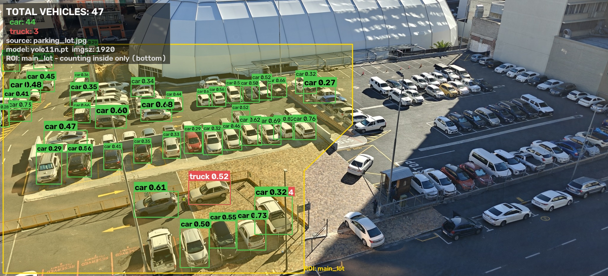

# Parking Lot and Traffic Vehicle Counter

[](https://www.python.org/)
[](https://github.com/ultralytics/ultralytics)
[](https://streamlit.io/)
[](https://opencv.org/)
[](https://opensource.org/licenses/MIT)

An easy-to-use computer vision system to detect, track, and count vehicles (cars, motorcycles, buses, and trucks) in parking lot images and video feeds using pre-trained YOLO11 with zero model training required.


*101 vehicles detected (96 cars, 4 trucks, 1 bus) in sample lot via Streamlit UI output (`outputs/ui/parking_lot_annotated.jpg`). Bounding boxes are color-coded per vehicle class with confidence scores.*


*Streamlit UI Annotated Output (`outputs/ui/imagepra_annotated.jpg`): 98 total vehicles detected (79 cars, 17 motorcycles, 1 bus, 1 truck) at 3000×2001 resolution.*

## Description

The Parking Lot and Traffic Vehicle Counter is a computer vision application built to automate vehicle monitoring, parking lot occupancy counting, and traffic flow analysis. It includes both a Command Line Interface (CLI) and an interactive Streamlit web dashboard.

### Project Guide Questions

- What was your motivation?
  Manual vehicle counting and parking monitoring is slow and prone to human errors. The goal was to build an automated, real-time vehicle analytics solution using computer vision that works out of the box without needing training data or expensive hardware.

- Why did you build this project?
  Most basic video counters count the same parked car in every single frame, leading to huge overcounting. This project solves that by separating Instantaneous Occupancy (cars in the current frame) from Cumulative Unique Vehicles (distinct vehicles tracked over time using ByteTrack). It also uses auto-resolution scaling so small or distant cars are not missed.

- What problem does it solve?
  - Accurately counts vehicles in busy parking lots and roads.
  - Gives two meaningful metrics: Current Occupancy and Total Traffic Volume.
  - Allows drawing custom Regions of Interest (ROI) to count only within specific parking areas or lanes.
  - Exports clean data (annotated images/videos, JSON summaries, and CSV reports).

- What did you learn?
  - Inference resolution is key: Auto-scaling resolution to match image size boosted detections from 9 to 101 vehicles with minimal speed impact.
  - Pre-NMS class filtering prevents non-vehicle objects (like pedestrians) from suppressing valid vehicle boxes.
  - In angled camera views, testing vehicle position at the bottom-center of the box (where tires touch the road) avoids perspective errors.
  - Requiring a vehicle track to survive for at least 3 frames removes flickering false detections.

## Architecture of the Application

```
                    ┌───────────────────────────────┐
                    │   Input Source (Image/Video)   │
                    └───────────────┬───────────────┘
                                    │
                                    ▼
                    ┌───────────────────────────────┐
                    │  OpenCV Frame/Image Ingest    │
                    │ (Preprocessing & Auto-Scaling)│
                    └───────────────┬───────────────┘
                                    │
                                    ▼
                    ┌───────────────────────────────┐
                    │    Ultralytics YOLO11 Core    │
                    │   (Pre-NMS Vehicle Filter)    │
                    └───────────────┬───────────────┘
                                    │
                     ┌──────────────┴──────────────┐
                     │ (Images)                    │ (Videos)
                     ▼                             ▼
        ┌─────────────────────────┐   ┌─────────────────────────┐
        │ Direct Bounding Boxes   │   │ ByteTrack Multi-Object  │
        │ & Confidence Scores     │   │ Tracker (Persistent IDs)│
        └────────────┬────────────┘   └────────────┬────────────┘
                     │                             │
                     └──────────────┬──────────────┘
                                    │
                                    ▼
                    ┌───────────────────────────────┐
                    │  ROI Geometric Containment    │
                    │ (Bottom-Center / Tire Anchor) │
                    └───────────────┬───────────────┘
                                    │
                                    ▼
                    ┌───────────────────────────────┐
                    │  OpenCV Annotation & Output   │
                    ├───────────────────────────────┤
                    │ • Rendered Media (JPG / MP4)  │
                    │ • Summary JSON & Per-frame CSV│
                    │ • Streamlit Interactive UI    │
                    └───────────────────────────────┘
```

Component Overview:
- pipeline.py: Core processing engine that runs image detection and video tracking workflows.
- detector.py: Wraps YOLO11 inference and formats raw outputs into clean detection objects.
- roi.py: Handles Region of Interest boundaries and point-in-polygon math.
- annotate.py: Uses OpenCV to draw boxes, labels, ROI boundaries, and summary count cards.

## Tech Stack

| Layer | Component | Technology | Simple Explanation |
|---|---|---|---|
| Frontend | Web Dashboard | Streamlit | Powers the interactive browser web application |
| Frontend | Custom UI Styling | Vanilla CSS3 | Dark glassmorphism theme, glowing gradients, and animated cards |
| Frontend | Interactive ROI Tool | streamlit-image-coordinates | Point-and-click tool to draw custom counting areas on images |
| Backend | Core Language | Python 3.10+ | Runs the CLI commands, backend logic, and processing pipelines |
| Backend | Object Detection AI | Ultralytics YOLO11 (`yolo11m`) | Uses `yolo11m` weights as default for maximum detection accuracy and vehicle precision |
| Backend | Vehicle Tracker | ByteTrack | Tracks moving vehicles so unique cars are counted only once |
| Backend | Deep Learning Engine | PyTorch | Runs AI model computations on CPU, GPU, or Apple Silicon |
| Backend | Computer Vision Engine | OpenCV | Reads videos, draws bounding boxes, and calculates ROI math |
| Backend | Data & Analytics | Pandas & NumPy | Summarizes counts into data tables and exports CSV reports |
| Backend | CLI Utilities | tqdm | Displays real-time progress bars when processing video files |
| Backend | Media Converter | FFmpeg | Converts output videos into web-compatible MP4 format |

## Model Selection (`yolo11m` for Best Accuracy)

We selected **`yolo11m.pt` (YOLO11 Medium)** as the default architecture for this application because it offers the highest vehicle detection accuracy.
Its enhanced feature extraction ensures exceptional precision when detecting small, distant, or heavily overlapping vehicles in dense parking lots and busy traffic environments.

## Key Features

- Multi-Class Vehicle Detection: Detects car, motorcycle, bus, and truck classes.
- Dual Video Counting:
  - Instantaneous Occupancy: Counts how many vehicles are in each frame.
  - Unique Vehicle Count: Counts total distinct vehicles that passed through the scene.
- Region of Interest (ROI) Filtering: Restrict detection to specific parking zones or road lanes.
- Auto-Resolution Scaling: Automatically matches inference size to input resolution to catch small distant cars.
- Dual Interfaces: Fast command line interface for scripts plus an easy Streamlit web dashboard.
- Multiple Export Formats: Generates annotated pictures/videos, JSON summary files, and CSV per-frame logs.

## Getting Started

### Prerequisites

- Python 3.10 or higher
- Git
- FFmpeg (optional, for browser video playback)

### Backend Setup

1. Clone the repository:
   ```bash
   git clone <your-repo-url>
   cd vehicle-counter
   ```

2. Create and activate a virtual environment:
   ```bash
   # macOS / Linux:
   python3 -m venv .venv
   source .venv/bin/activate

   # Windows (PowerShell):
   python -m venv .venv
   .venv\Scripts\Activate.ps1
   ```

3. Install dependencies:
   ```bash
   pip install -r requirements.txt
   ```

4. Download sample media:
   ```bash
   python tools/fetch_samples.py
   ```

### Frontend Setup

1. Make sure your virtual environment is active.
2. Start the Streamlit web app:
   ```bash
   streamlit run app.py
   ```
3. Open your browser at `http://localhost:8501`.

## Usage

### Image Detection

Run detection on a single parking lot photo:
```bash
python detect_vehicles.py --source data/input/parking_lot.jpg
```

Example CLI Output:
```text
Vehicles detected
-----------------
  car            96
  truck           4
  bus             1
  TOTAL         101

Annotated image : outputs/parking_lot_annotated.jpg
Counts JSON     : outputs/parking_lot_counts.json
```

### Video Tracking and Counting

Process a traffic video clip with ByteTrack vehicle tracking:
```bash
python detect_vehicles.py --source data/input/street_traffic.mp4
```

Example CLI Output:
```text
Busiest frame (peak occupancy)
------------------------------
  car            15
  TOTAL          15

  mean occupancy : 8.1 vehicles per frame

Unique vehicles across the clip (track seen in >= 3 frames)
-----------------------------------------------------------
  car           112
  truck           4
  bus             2
  motorcycle      1
  TOTAL         119

  raw track ids before filtering: 263
```

### Region of Interest (ROI) Filtering

Limit vehicle detection to specific parking rows or roadway lanes:


Restricting the ROI to the main lot drops the count from 101 to 47, excluding neighbor lots and the public road.

1. Interactive Desktop ROI Picker (OpenCV GUI):
   ```bash
   python tools/roi_picker.py --source data/input/parking_lot.jpg --out data/roi/main_lot.json
   ```
   - Left Click: Add polygon point
   - Right Click: Undo last point
   - s key: Save ROI JSON
   - r key: Reset / q key: Quit

2. Run detection using the saved ROI:
   ```bash
   python detect_vehicles.py --source data/input/parking_lot.jpg --roi data/roi/main_lot.json
   ```

3. In-Browser Polygon Drawing:
   In the Streamlit Web UI, select "Draw polygon" under ROI options and click directly on the image to place vertices.

### Interactive Web UI

Launch the Streamlit web dashboard:
```bash
streamlit run app.py
```

Web UI capabilities:
- Upload your own images or video files.
- Adjust confidence threshold, IoU threshold, and target vehicle classes.
- Draw custom ROI polygons interactively.
- Inspect detection tables with coordinates and confidence ratings.
- Download annotated media, JSON summaries, and CSV reports.

#### Sample Streamlit Web UI Outputs (`outputs/ui/`)


*Annotated UI Output (`outputs/ui/parking_lot_annotated.jpg`): Interactive Streamlit web dashboard detection result showing 101 total vehicles detected (96 cars, 4 trucks, 1 bus) with color-coded bounding boxes and real-time HUD summary.*


*Annotated UI Output (`outputs/ui/imagepra_annotated.jpg`): Interactive Streamlit web dashboard detection output featuring 98 total vehicles detected (79 cars, 17 motorcycles, 1 bus, 1 truck) at 3000×2001 resolution.*

### Command Reference

| Flag | Default | Description |
|---|---|---|
| `--source` | Required | Path to input image (.jpg, .png) or video (.mp4, .avi, .mov). |
| `--model` | `yolo11n.pt` | Model weights file (yolo11n.pt, yolo11m.pt, etc.). |
| `--conf` | `0.25` | Minimum confidence score threshold in range 0.0 to 1.0. |
| `--iou` | `0.45` | NMS IoU threshold for overlapping bounding boxes. |
| `--imgsz` | `auto` | Inference image size (640, 1280, 1920, or auto). |
| `--device` | `auto` | Compute device (cpu, 0 for CUDA GPU, or mps for Apple Silicon). |
| `--classes` | `car motorcycle bus truck` | Target vehicle classes to count. |
| `--roi` | `None` | Path to ROI JSON file. |
| `--roi-rule` | `bottom` | Containment rule: bottom (tire anchor), center, or overlap. |
| `--labels` | `auto` | Box label style: auto (adaptive), full (always visible), none. |
| `--min-track-hits` | `3` | Minimum frames a track must persist to count as a unique vehicle. |
| `--stride` | `1` | Video frame processing stride (e.g. 2 skips every other frame). |
| `--max-frames` | `None` | Maximum video frames to process (useful for rapid testing). |
| `--no-track` | `False` | Disables tracking in video mode (calculates occupancy only). |
| `--out` | `outputs` | Output directory for saved results. |
| `--no-json` | `False` | Suppresses saving JSON and CSV sidecar files. |

## Project Structure

```
vehicle-counter/
├── app.py                    # Interactive Streamlit Web Dashboard
├── detect_vehicles.py        # Command Line Interface (CLI) entry point
├── requirements.txt          # Python package dependencies
├── README.md                 # Full project documentation & tech stack
├── WALKTHROUGH.md            # Simplified study guide & system walkthrough
├── .gitignore                # Git ignore configuration
├── yolo11n.pt                # YOLO11 Nano model weights (~5.6 MB)
├── yolo11m.pt                # YOLO11 Medium model weights (~40.6 MB)
│
├── vehicle_counter/          # Core Python vehicle counter package
│   ├── __init__.py           # Package exports
│   ├── config.py             # Colors, class mappings & device detection
│   ├── detector.py           # YOLO11 model wrapper & Detection data model
│   ├── pipeline.py           # Image detection & video tracking pipelines
│   ├── roi.py                # Normalized ROI geometry & point containment logic
│   └── annotate.py           # Bounding box, class label & HUD renderer
│
├── tools/                    # Helper utilities
│   ├── fetch_samples.py      # Automated sample image and video downloader
│   └── roi_picker.py         # Desktop OpenCV GUI for drawing and saving ROI JSONs
│
├── data/                     # Data directory
│   ├── input/                # Sample input images and traffic videos
│   └── roi/                  # Saved ROI polygon JSON definitions
│
├── examples/                 # Committed sample output results
│   ├── parking_lot_annotated.jpg
│   ├── parking_lot_roi_annotated.jpg
│   ├── imagepra_annotated.jpg
│   ├── street_traffic_annotated.mp4
│   └── street_traffic_per_frame.csv
│
└── outputs/                  # Processing output directory (Images, Videos, JSON/CSV)
    └── ui/                   # Streamlit Web UI outputs (parking_lot_annotated.jpg, imagepra_annotated.jpg)
```

## Features

- Pre-NMS Filtering: Discards non-vehicle classes prior to Non-Maximum Suppression to prevent false suppression.
- Tire-Ground ROI Anchor (bottom rule): Evaluates vehicle containment at the bottom-center of the bounding box to eliminate perspective distortion.
- Robust Multi-Object Tracking: Uses ByteTrack with linear assignment to maintain vehicle identities across movement and occlusions.
- Track Noise Filtering: Configurable threshold ensures transient flicker does not corrupt unique vehicle statistics.
- Occupancy Time-Series: Automatically logs frame-by-frame vehicle counts to CSV and plots occupancy trends in the web dashboard.
- High-Resolution Auto-Scaling: Automatically selects optimal inference dimensions without manual resizing.

## How to Contribute

Contributions are welcome:

1. Fork the Repository on GitHub.
2. Create a Feature Branch:
   ```bash
   git checkout -b feature/new-feature
   ```
3. Commit Your Changes:
   ```bash
   git commit -m "Add: support for aerial drone cameras and custom ROI shapes"
   ```
4. Push to Your Branch:
   ```bash
   git push origin feature/new-feature
   ```
5. Open a Pull Request on GitHub.

## Tests

Run the following test commands to verify your setup:

1. Test Image Detection Pipeline:
   ```bash
   python detect_vehicles.py --source data/input/parking_lot.jpg --out outputs/test_image
   ```
   Expected: 101 vehicles detected; creates `outputs/test_image/parking_lot_annotated.jpg` and `parking_lot_counts.json`.

2. Test ROI Geometric Containment:
   ```bash
   python detect_vehicles.py --source data/input/parking_lot.jpg --roi data/roi/main_lot.json --out outputs/test_roi
   ```
   Expected: Vehicle count drops to 47 vehicles inside the main lot.

3. Test Video Tracking & CSV Export (Quick 60-frame test):
   ```bash
   python detect_vehicles.py --source data/input/street_traffic.mp4 --max-frames 60 --out outputs/test_video
   ```
   Expected: Progress bar runs, outputs annotated video clip, JSON summary, and `street_traffic_per_frame.csv`.

4. Test Web Dashboard:
   ```bash
   streamlit run app.py --server.headless true
   ```
   Expected: Streamlit starts up without errors.

## Credits

- Object Detection: [Ultralytics YOLO11](https://github.com/ultralytics/ultralytics) by Glenn Jocher and the Ultralytics team.
- Object Tracking: [ByteTrack](https://github.com/ifzhang/ByteTrack) multi-object tracker.
- Web UI Framework: [Streamlit](https://streamlit.io/).
- Sample Media:
  - Parking lot photograph by Husskeyy (CC BY-SA 4.0 via Wikimedia Commons).
  - Video footage sourced under open-access creative commons licenses (see `data/input/SOURCES.md`).

## License

This project is licensed under the MIT License. See the [LICENSE](LICENSE) file for details.
